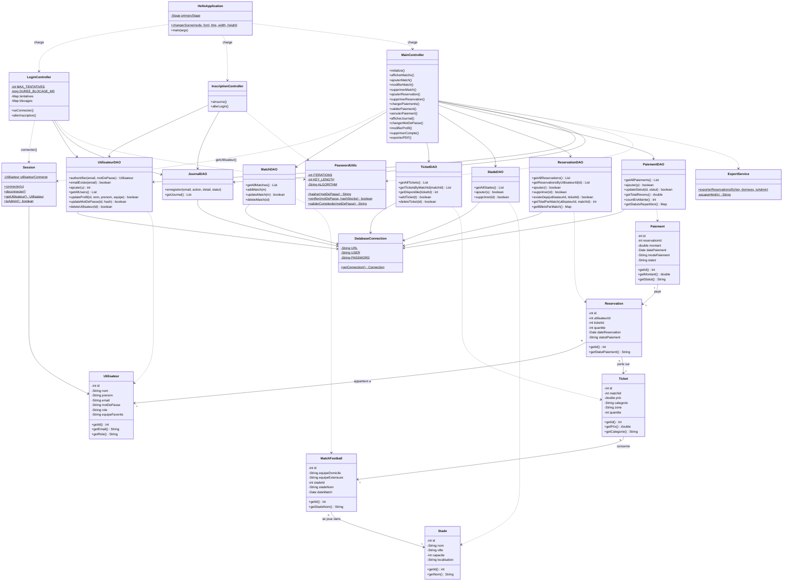
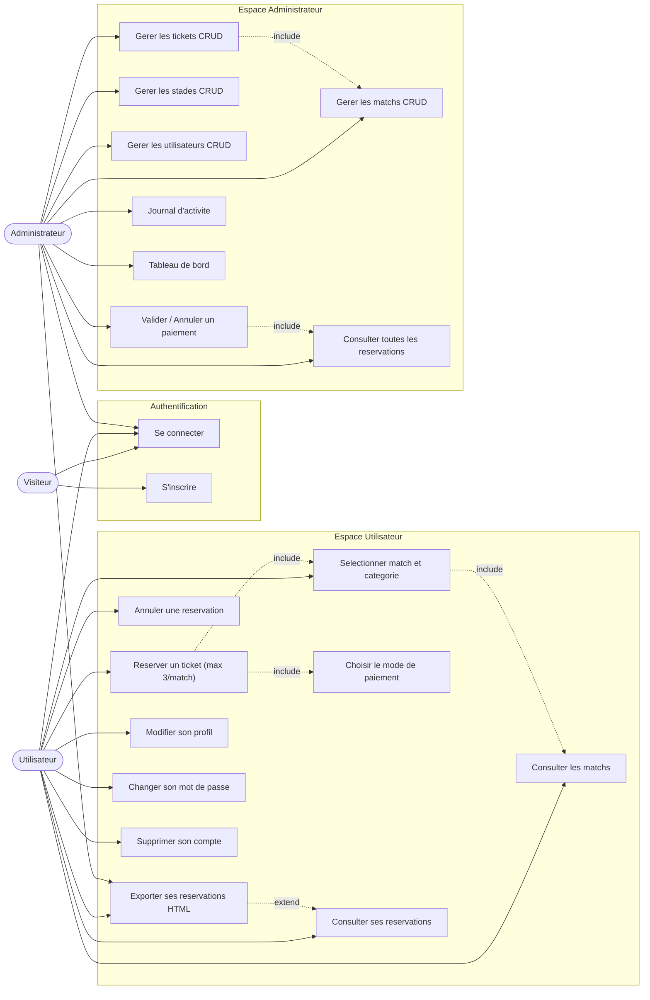
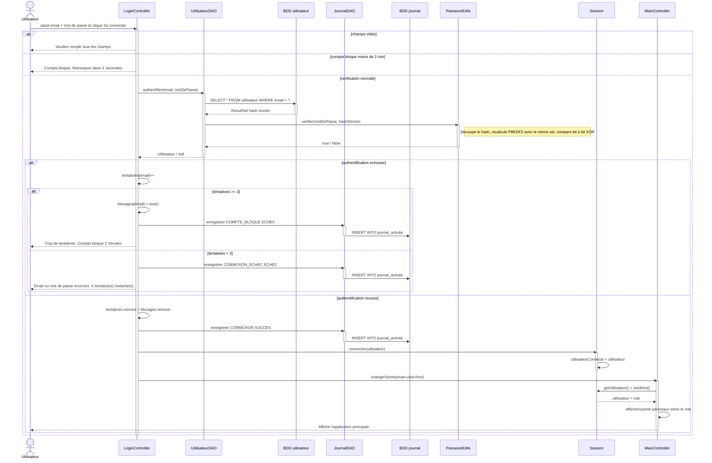
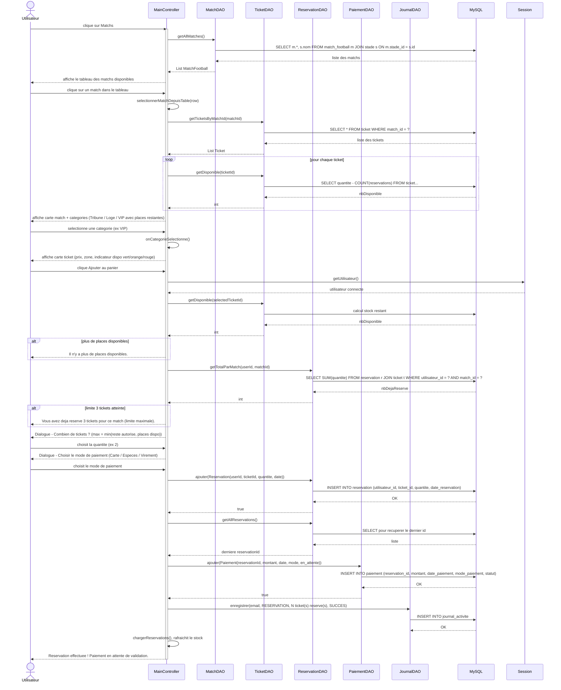
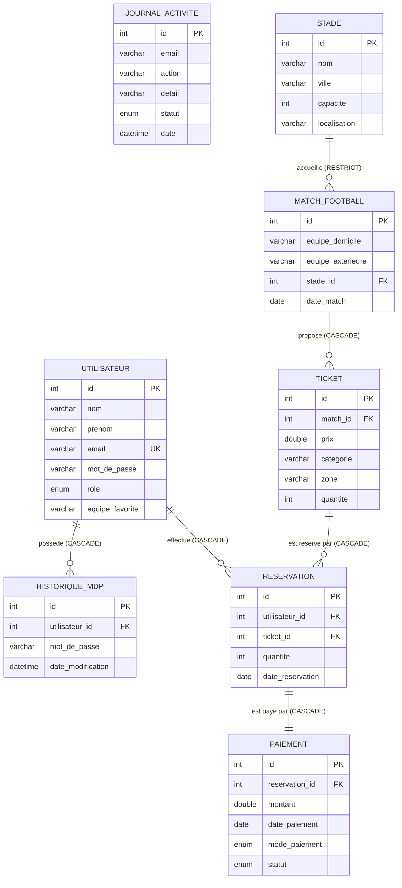

# Diagrammes UML — Football Ticket Manager

## 1. Diagramme de classes

---

## 2. Diagramme de cas d'utilisation

---

## 3. Sequence — Connexion

---

## 4. Sequence — Reservation d'un ticket

---

## 5. MLD — Base de donnees

